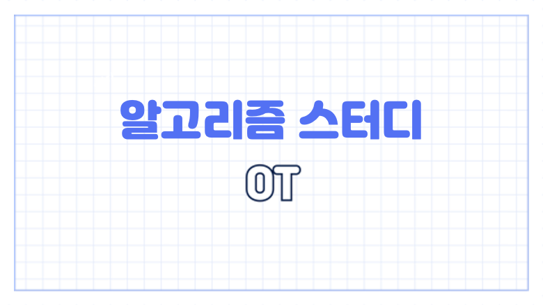

안녕하세요 부경대학교 알고리즘 스터디 1주차 OT 안내해드릴게요 :)

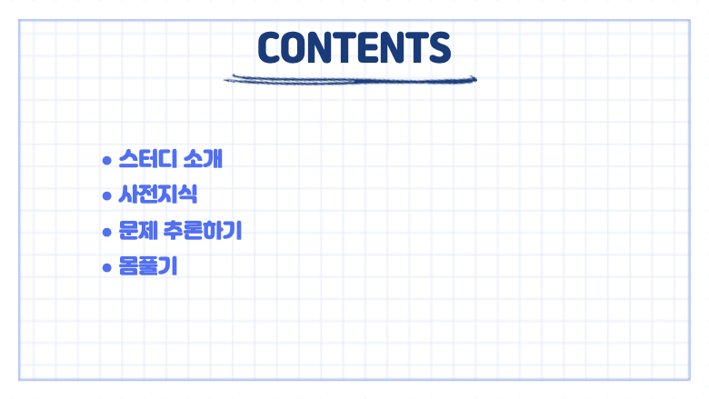

오늘은 알고리즘을 다루지는 않을거고 스터디 소개, 사전지식, 문제 추론하기, 간단한 문제 풀어보도록 할게요.

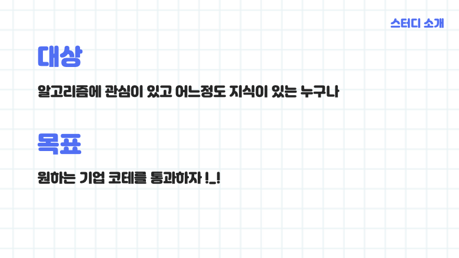

우리 스터디는 99%가 고학년 전공자입니다. 그렇기 때문에 알고리즘 문제를 풀기 위한 사전지식 자료구조, 알고리즘 관련 수업을 이미 수강했다는 걸 전제하고 스터디 진행하겠습니다. 기본적인 알고리즘 내용이나 구현 방법은 다루지 않을 거에요. (수업에서 다루지 않는 거지 스터디 중에 편하게 물어보셔도 됩니다) 

많은 분들의 목표가 대기업 코테 합격이실 테니 코테 트렌드를 분석해서 문제집에 최대한 녹이고 코테와 비슷한 환경을 만들어 모의고사 진행할 수 있도록 하겠습니다.

자, 열심히 공부하기 전에 자극을 받아야 하니깐 제가 아는 코테를 보는 기업들을 모아봤습니다. 제가 아는 것만 모아본거지 훨씬 더 많으니깐 열심히 해봅시다 👏

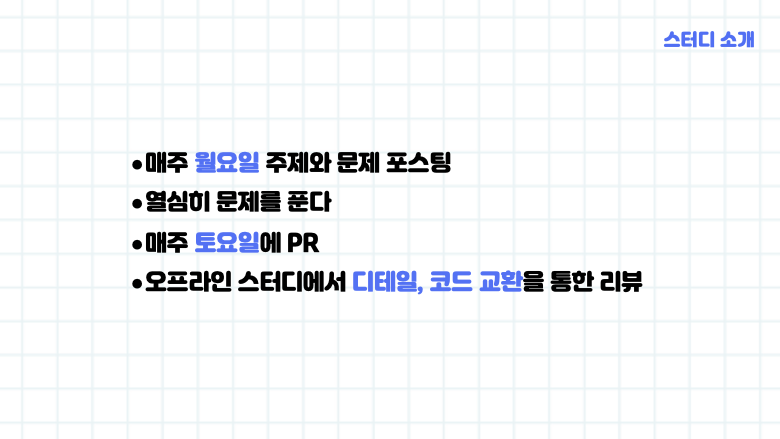

다음은 스터디 진행방법입니다. https://github.com/MongsangGa/pknu_Algorithm 모두에게 위 레포 초대를 보냈습니다. 본인 저장소로 포크를 따주시고 로컬에 클론을 만들어 주세요. 현재 주차 폴더 내에 본인의 이름으로 폴더를 만들고 소스코드를 저장해 주시면 됩니다. 자세한 내용은 레포에 README 를 참고해 주세요. 

매주 월요일에 주제와 문제를 선정해서 올릴 예정이고 토요일에 한 번에 풀리퀘스트 해주시면 됩니다. 오프라인 스터디에서는 알고리즘 디테일, 코드 교환을 하면서 서로의 코드를 개선해 보도록 할게요.

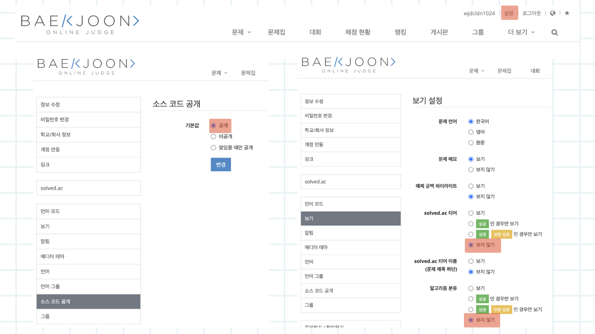

백준에서 환경을 설정하도록 할게요. 백준 오른쪽 상단 메뉴에서 설정을 눌러서 들어간 뒤 소스 코드를 공개로 변경해 주시고, 보기에서 티어 보지 않기, 알고리즘 분류 보지 않기로 설정해 주세요.

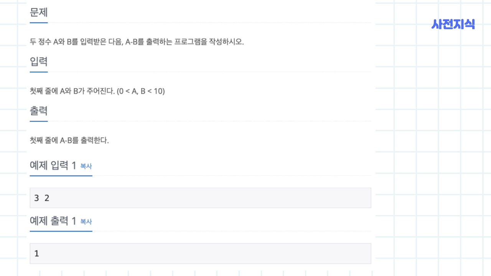
다음은 사전지식입니다. 알고리즘 문제는 위와 같이 문제 설명, 입력과 출력이 주어지죠. 예제 입출력이 올바르게 나와도 틀릴수도 있습니다. 보여지지 않는 예제 입력 (테스트 케이스)가 많기 때문에 문제에 조건에 맞춰서 직접 다양한 입출력을 작성해 보는 게 좋아요.

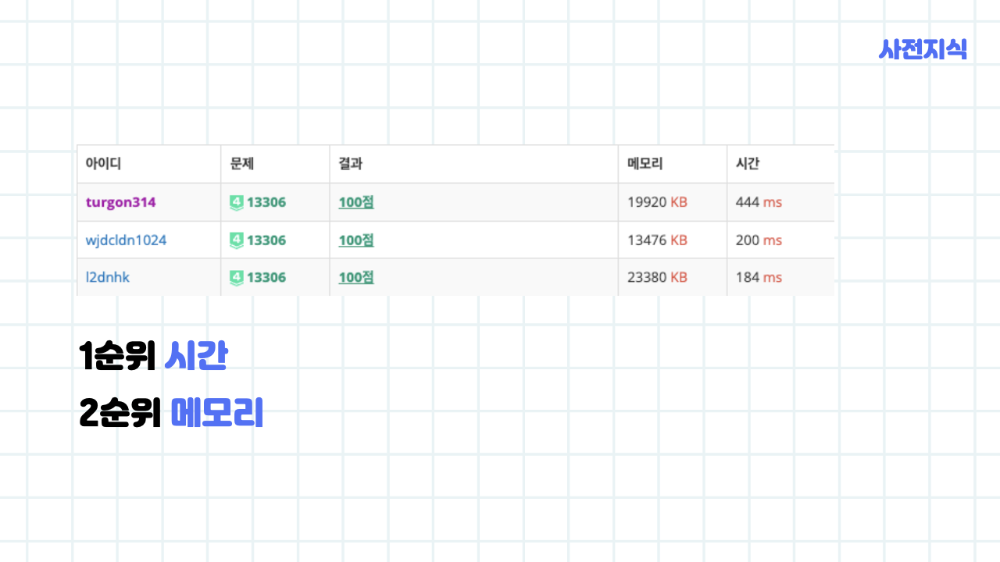

자 위에 세 사람은 모두 만점을 맞았습니다. 똑같은 만점이라도 빠른 시간 적은 메모리를 사용해 문제를 푼 사람이 더 높은 등수를 얻습니다. 기왕이면 빠르고 효율적으로 구현하는 게 좋겠죠.

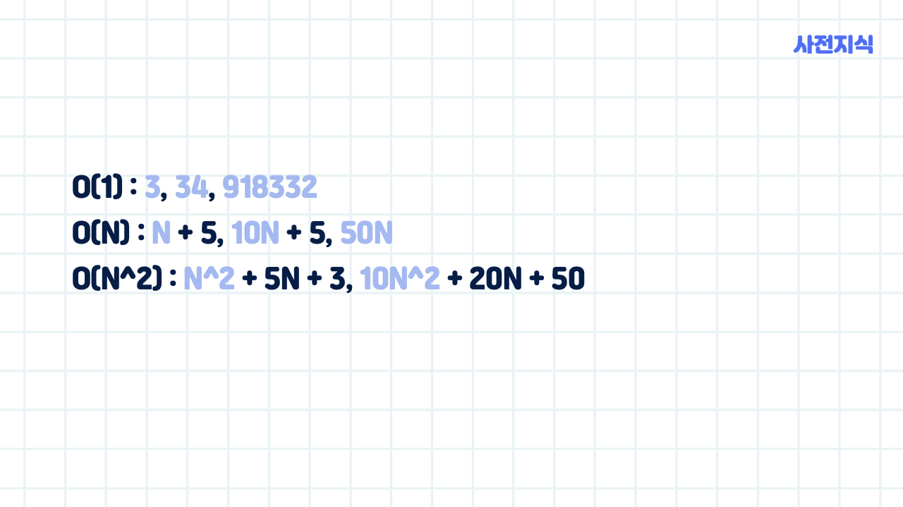

빅오 표기법입니다. 다들 배우셨을 텐데 최고차항만 고려해 주시면 됩니다. 최고차항 이외에는 $N$ 값이 커지면 총 연산에 큰 영향을 주지 않기 때문에 무시해도 돼요. 위 예제로 다시 한번 복습해 보세요.

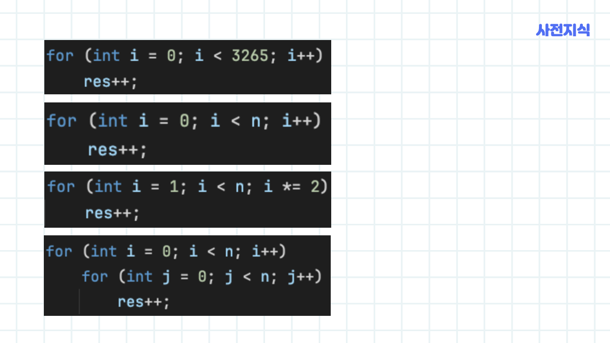

빅오 표기법을 실습 해보겠습니다. 

첫번째 예제는 반복문이 3265 번 반복되기 때문에 O(1) 

두번째 예제는 반복문이 $N$ 번 반복되기 때문에 O($N$)

세번째 예제는 반복문이  $lgN$  번 반복되기 때문에 O($lgN$ )

네번째 예제는 반복문이 $N^2$ 번 반복되기 때문에 O($N^2$)

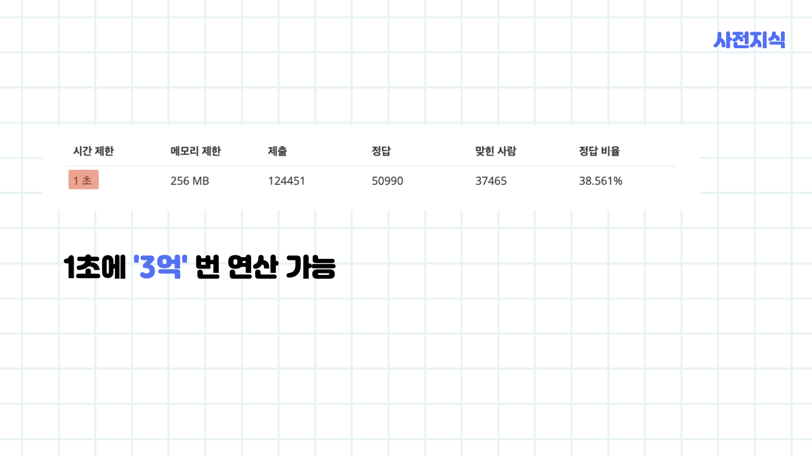

자 그럼 백준으로 실습해 볼게요. 모든 알고리즘 문제는 시간제한이 있습니다. 위 예제의 경우에는 1초이죠. 컴퓨터는 1초에 대략 3억회 연산을 처리할 수 있습니다. 하지만 이는 어림값이기 때문에 곱하기와 나누기와 같은 복잡한 연산에는 주의하셔야 합니다.

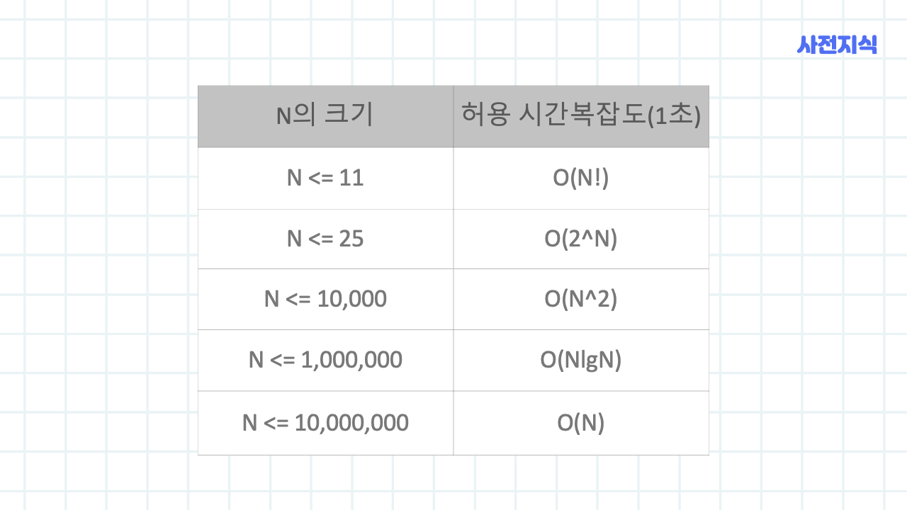

1초에 3억회 정도 연산이 가능하다는걸 알았으니 위와 같이 $N$ 의 크기에 따라서 사용 가능한 시간 복잡도를 추정할 수 있습니다.

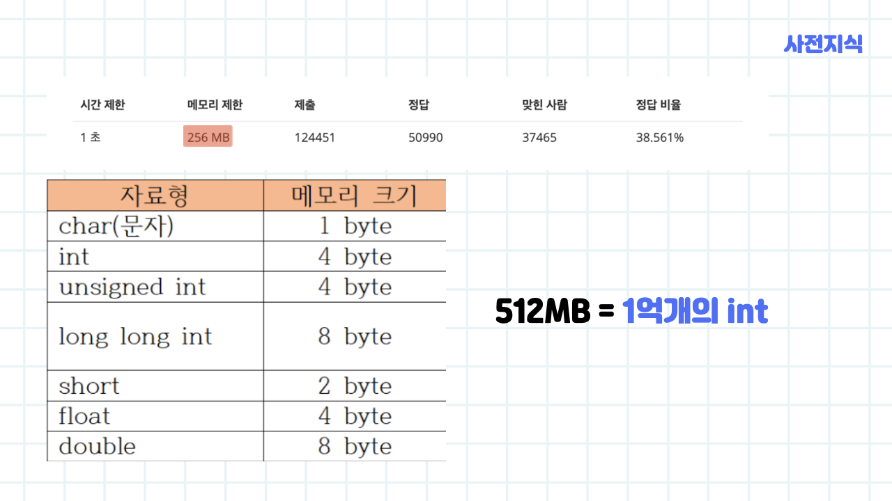

다음은 공간복잡도를 살펴보도록 할게요. 위 문제의 경우에는 메모리가 256 MB 로 제한되어 있죠. 하지만 어느 정도인지 체감이 잘 안 되니깐 int 형을 기준으로 외워버리도록 하겠습니다. int 형은 4byte 이니 512MB 기준 대략 1억개의 int 를 사용할 수 있습니다. 위 문제에 적용해 보면 대략 오천만 개의 int 사용할 수 있겠죠.

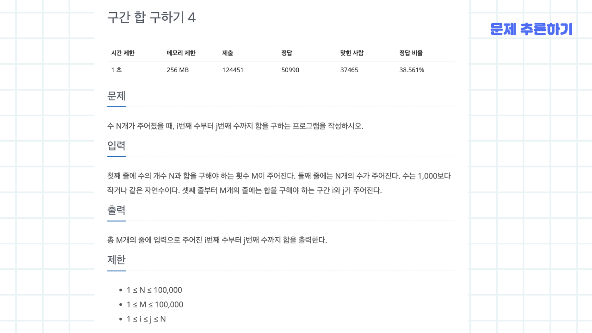

마지막으로 오늘 배운 걸 토대로 문제를 추론해 보겠습니다. 문제를 읽어보면 N 개의 수가 주어지고 i 번째 수부터 j 번째 수까지 합을 구하는 문제입니다. 하지만 i 번째 수부터 j 번째 수까지 합이 M 번 입력됩니다.

입력 제한 값을 보면 100,000 인데 M 입력이 들어오는 데로 합을 구해서 출력하면 최악의 경우 $O(NM)$ 으로 10억 번 연산이 필요하니 시간초과가 발생한다는 것을 알 수 있죠. 그러니 더 빠른 다른 알고리즘이 필요하다는 것을 알 수 있습니다.

이런 식으로 시간, 메모리 제한에 따라 사용 가능한 알고리즘을 줄여가며 추론할 수 있겠죠. 오늘은 여기까지입니다. 오늘 배운 내용을 토대로 재밌게 문제 풀어봅시다!!