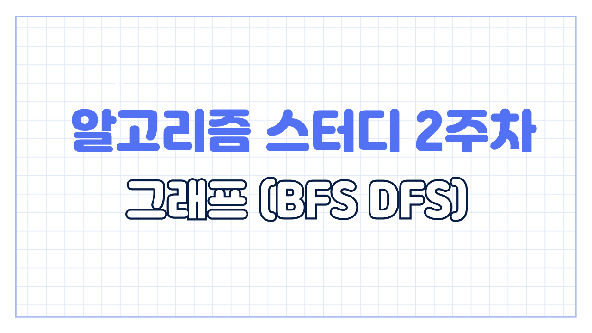
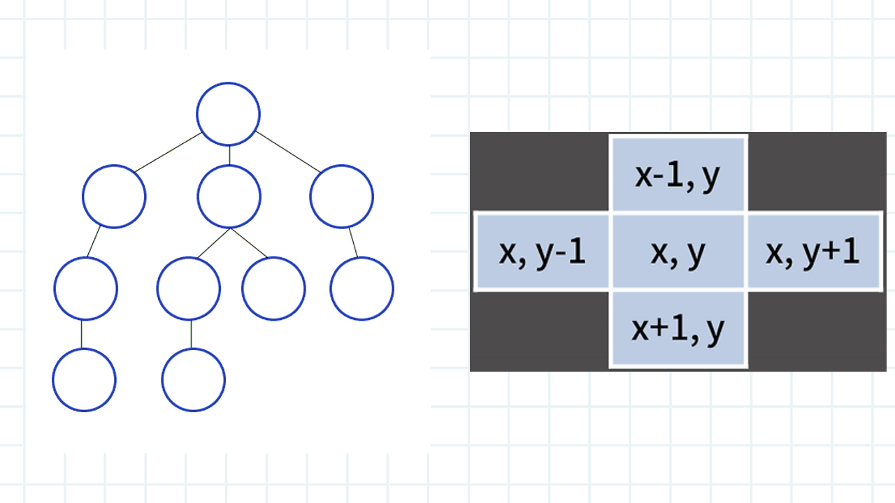
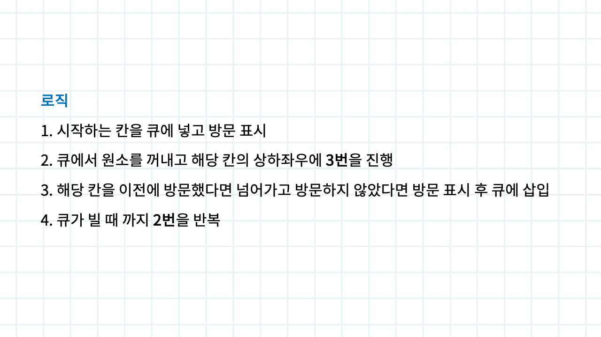
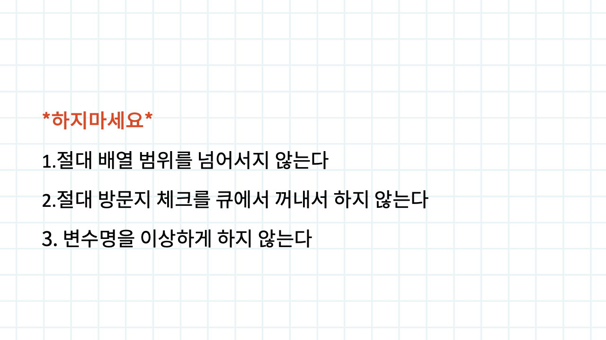
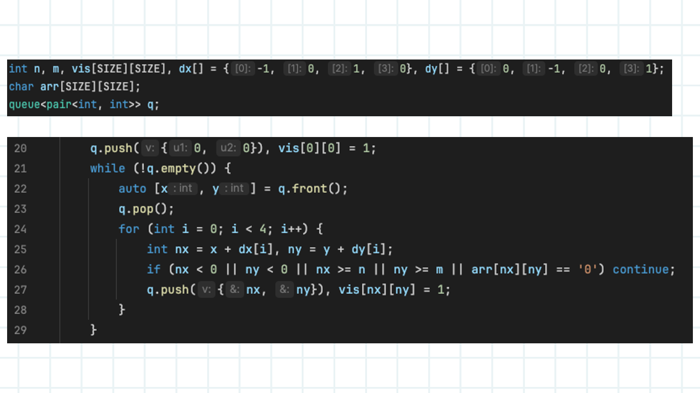
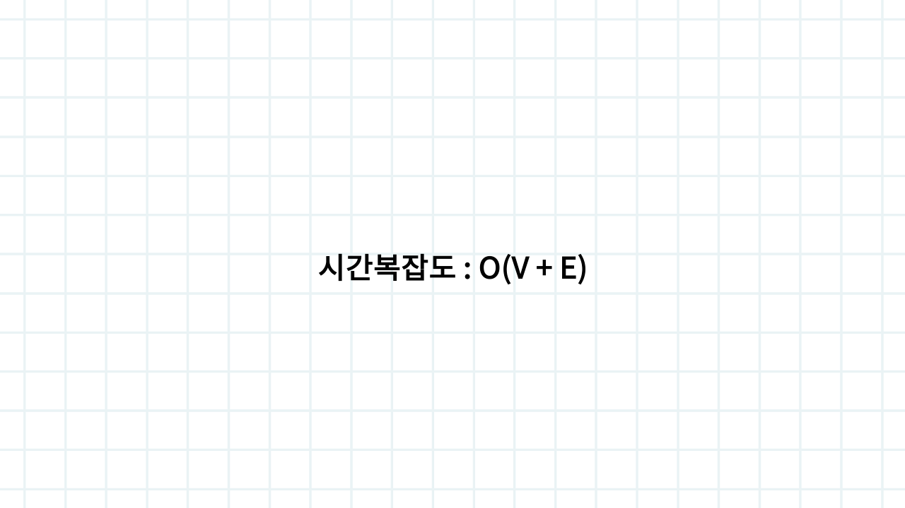

# 2주차

생성 일시: 2024년 8월 15일 오후 3:55

2주차입니다. 본격적으로 시작해볼게요. 이번주차는 BFS 를 배워볼건데 위 표지는 제가 잘못 만들었습니다,, DFS 는 다음 주차에 배울게요 😊

BFS 는 기본적으로 그래프를 탐색하는 알고리즘이죠. 왼쪽같이 생긴걸 인접행렬 이라고 부르고, 오른쪽 생긴걸 이차원 행렬 이라고 부릅니다. BFS 는 이런 그래프에서 너비 우선적으로 문제에 조건에 맞춰서 탐색하는 알고리즘 입니다. 너비 우선적 에 대해서 이해가 잘 안되신다면 구글에 BFS 로 검색하면 엄청 많은 예제가 있으니 참고해보시면 좋을거 같아요.

다음은 로직입니다. BFS 는 기본적으로 큐로 구현하는 것이 정석입니다. 다들 아실테지만 한번 따라가 볼게요.

1. 시작하는 위치 (x, y) 를 큐에 넣고 방문 배열을 만들어 표시한다
2. 큐에서 원소를 꺼내고 해당 칸의 상하좌우에 대해서 아래 3번 을 진행한다
3. 해당 칸을 이전에 방문했다면 넘어가고 방문하지 않았다면 방문 표시 후 큐에 삽입한다
4. 큐가 빌 때 까지 반복한다

입니다. 아래에 코드가 있으니 구체적인 구현방법은 아직 안떠오르셔도 괜찮아요. 로직만 이해해주세요

유의사항입니다. 

1. 절대 배열 범위 넘지 마세요. 코테 환경에서 최대한 빨리 풀어야 하니깐 오류는 줄이는게 좋겠죠
2. 방문지 체크를 큐에 꺼내서 하면 안됩니다. 이건 시간 복잡도 설명할 때 추가로 설명할게요
3. 변수명을 이상하게 하지 마세요. BFS 는 기본적으로 코드가 긴 편이라서 본인의 코드가 헷갈리면 안됩니다. 동일한 분류의 알고리즘 문제를 풀 때 변수명을 고정하는 습관을 들이세요

예제 코드입니다. 라인대로 설명해볼게요

1. 20번 라인은 위에서 설명했던 로직에서 1번에 해당되겠죠. 큐에 시작점 (x, y) 를 넣고 방문지 체크하는 2차원 배열 vis 함수를 1로 변경해주는 코드 입니다
2. 21번 라인은 로직에서 4번에 해당되겠죠. 큐가 빌 때 까지 계속 반복해주는 코드입니다
3. 22번 라인에서 큐의 최상단에서 (x, y) 값을 가져온뒤, 값을 저장했으니 23번 라인에서 팝해줍니다. 로직에서 2번에 해당되겠죠
4. 24번 라인부터는 로직에서 3번에 해당됩니다. 25번 라인에서 상하좌우의 좌표 값을 만듭니다. 26번 라인에서 만든 좌표 값이 배열 범위를 넘어서는지, 문제의 조건에 맞는지 체크하고 맞지 않다면 continue 시킵니다. 그럼 27번 라인에는 조건에 부합한 좌표만 남아있으니 큐에 넣어주고 방문 처리 해줍니다.

BFS의 시간 복잡도는 O(노드 개수 + 간선 개수) 입니다. 하지만 방문지 체크를 큐에서 새로운 좌표를 넣는 과정에서 하지 않고, 큐에 좌표를 빼는 과정에서 하면 시간이 늘어날 수 있습니다. 왜나하면 큐는 선입선출이죠. 그 해당 칸의 큐를 방문지 처리를 하기 전에 다른 노드에서 해당 방문지를 방문하는 경우가 생길 수 있겠죠. 그래서 간선의 개수에 따라 시간이 증가할 수 있습니다. 특히 BFS 는 쉬운 난이도의 알고리즘이니깐 0ms 다들 완벽하게 풀겠죠. 이런거에 실수하면 안되니깐 잘 기억해둡시다. BFS 는 구현에 가까워서 문제를 많이 풀어보는게 중요해요. 문제 풀러 출발!!