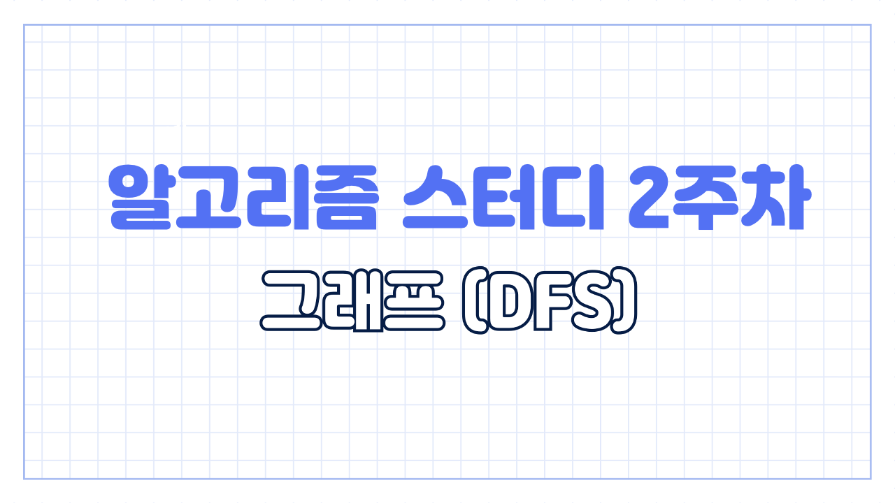
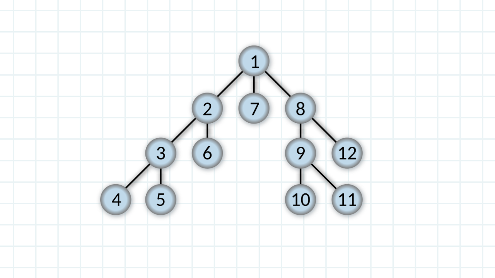
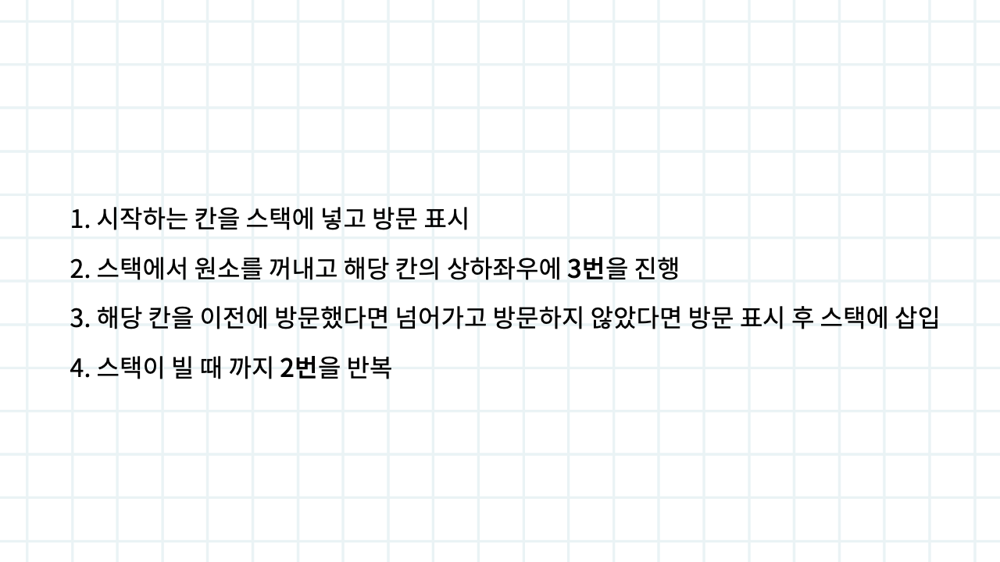
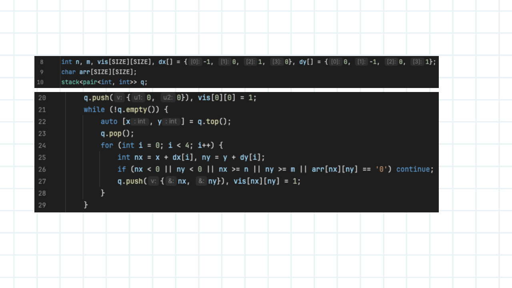
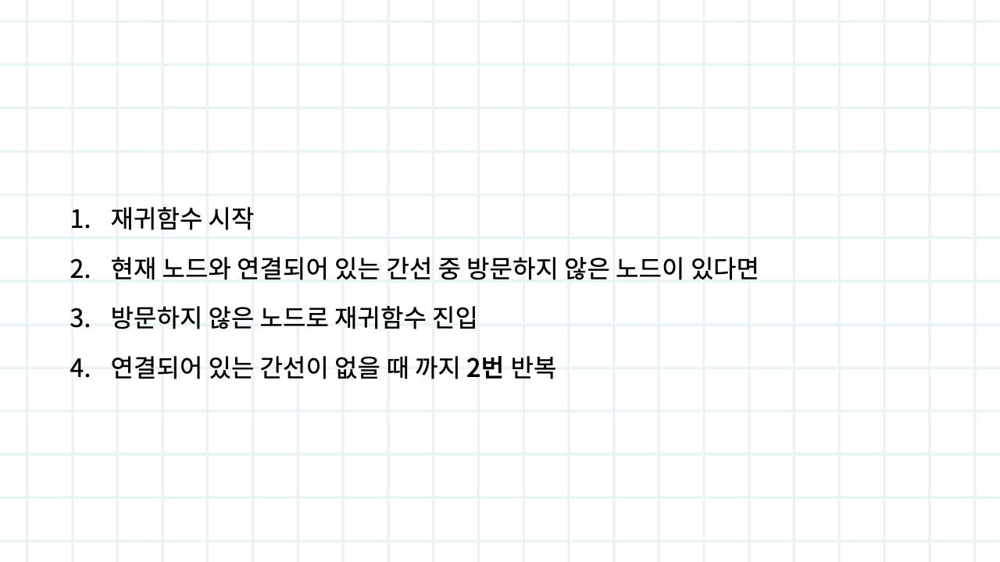
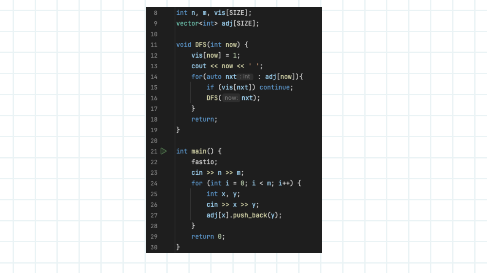
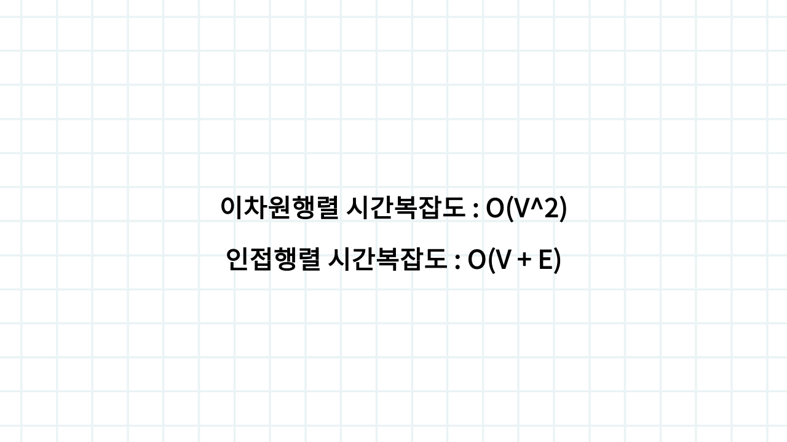

# 3주차 DFS

3주차 입니다. 지난 주차 BFS 에 이어서 깊이 우선 그래프 탐색 기법 DFS 알아보도록 하겠습니다

깊이 우선 탐색은 위와 같이 진행됩니다. 단어 뜻 그 자체로 먼저 연결되어 있는 간선을 방문해 다음 노드를 탐색한다는 뜻입니다. 이차원 행렬이나 인접 행렬에 관해서는 지난주에 설명했으니 넘어가도록 할게요

DFS 는 보통 재귀적으로 구현됩니다. 하지만 알고리즘 공부를 시작한지 얼마 안된 우리에게는 재귀적으로 구현하는 것이 여러모로 힘들 수 있어서 스택으로도 구현으로 구현하는 방법도 알아보도록 할게요. 로직은 지난주 BFS 로직과 동일하고 자료구조만 변경했습니다. BFS 에서 큐를 사용했다면 DFS 에서는 스택을 사용해서 구현하면 됩니다. 진짜 간단하죠

예시 코드입니다. 진짜 기존 BFS 코드에서 큐 STL 을 스택 STL 로 바꿔준거 밖에 없습니다

그래도 어디가서 DFS 할 줄 안다 라고 말할려면 재귀적으로 구현하는 것은 반드시 알아야겠죠. 로직 따라가보도록 할게요

1. 시작 노드 설정해서 DFS 재귀 함수 시작
2. 현재 노드와 연결되어 있는 간선 중 방문하지 않은 노드가 있다면
3. 방문하지 않은 노드로 DFS 재귀 진입
4. 연결되어 있는 간선이 없을 때 까지 2번을 반복

위 코드를 보면서 로직을 따라가보는게 훨씬 이해하기 쉽습니다. 잘 되지 않을 때는 재귀함수가 어떻게 동작하는지 실제로 손으로 적어보는게 좋아요

시간 복잡도 입니다. 지난 주차에서 설명을 미흡하게 했는데 기본적으로 BFS 와 DFS 시간 복잡도는 동일합니다. 이차원 행렬에서는 노드의 개수의 제곱, 인접 행렬에서는 노드 개수 더하기 간선 개수 입니다.

사실 그래프 탐색 문제에서는 시간 복잡도가 크게 중요하지 않습니다. 구현 능력을 확인할려고 내는 경우가 많기 때문에 많은 문제를 풀어보는게 중요해요. 문제집에 최대한 다양한 유형을 담을려고 노력하지만 부족할 수 있어요. 솔브드에서 태그를 BFS DFS 로 설정해 다양한 문제를 풀어보시기 바랍니다