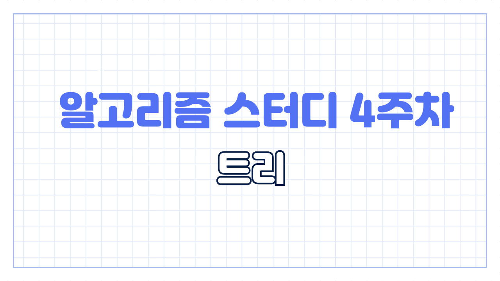
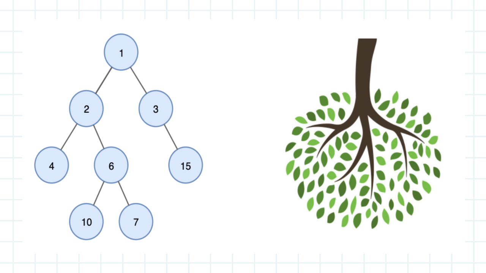
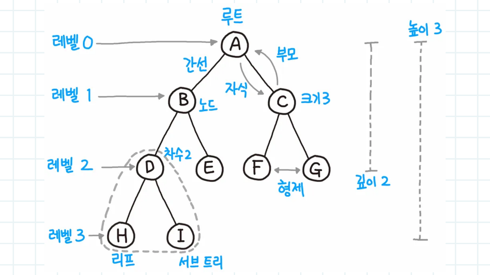

# 4주차 트리

이번주차는 트리입니다. 2 3주차에서 그래프 탐색 기법을 배웠으니 무방향 그래프 스테디셀러인 트리를 공부해봐야겠죠

오른쪽 사진과 같이 나무를 반대로 한 형태와 비슷하다고 하여 트리라고 불립니다. 트리는 기본적으로 방향성이 없는 무방향 그래프이며 사이클이 존재하지 않습니다. 만약 왼쪽 사진에서 10번 노드와 7번 노드가 연결되어 있으면 트리로 정의되지 않습니다

트리 문제는 용어가 많은 편입니다. 모르면 문제를 못푸니 알아보도록 할게요

먼저 트리는 어떤 노드든 루트가 될 수 있습니다. 위 그림에서는 A 노드가 루트지만 D 를 잡고 가장 상단으로 올리면 다른 노드가 아래로 떨어지듯이 모든 노드가 가능합니다. 노드와 노드를 이어주는 선을 간선이라고 부릅니다. 트리의 깊이를 높이 또는 레벨이라고 부릅니다. 자신과 연결된 이전 레벨 노드를 부모라고 부르며 두개 이전 노드를 조상이라고 부릅니다. 관점을 반대로 하면 자식 자손이겠죠? 같은 부모를 가진 같은 레벨의 노드를 형제라고 부릅니다. 자식이 없는 노드를 리프노드 라고 부르며 부모 노드와 연결된 간선을 끊었을 때 생성되는 트리를 서브트리라고 합니다.

용어는 이정도 알아보겠습니다. 트리는 간선으로 이루어지기 때문에 DFS 로 구현되는것이 일반적입니다. 구현 방법이 잘 기억이 나지 않는다면 지난 주차에 푼 문제들을 참고하면서 진행해주세요

코테를 준비하시는 분들은 이번 문제집에서 민서의 응급 수술, 사회망 서비스, 우수 마을 3문제는 꼭 풀어보시길 추천드립니다. 4주차도 화이팅하세요~