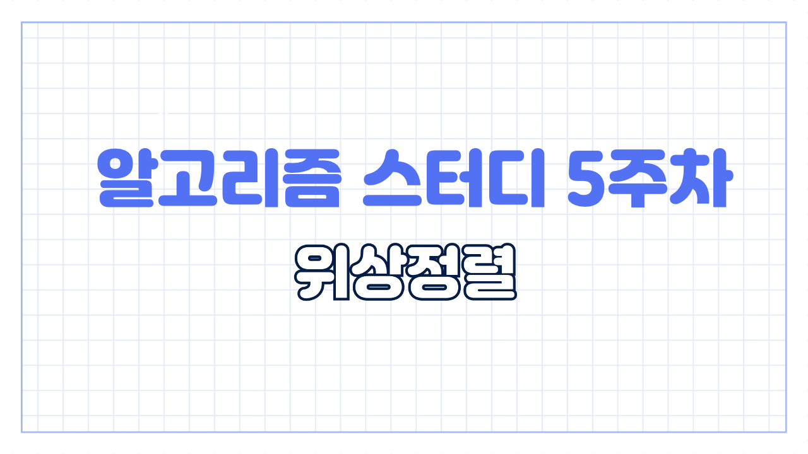
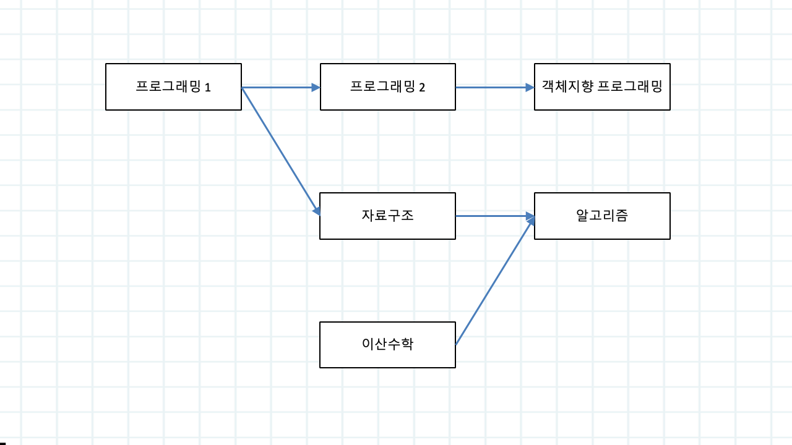
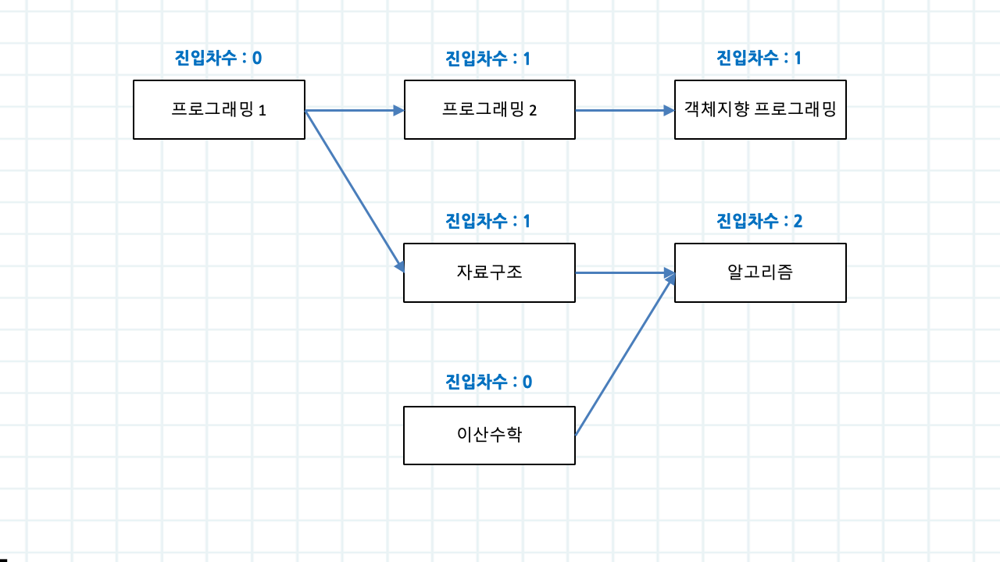
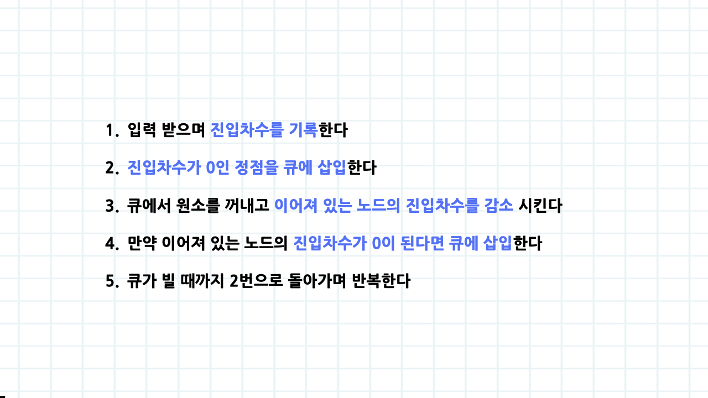
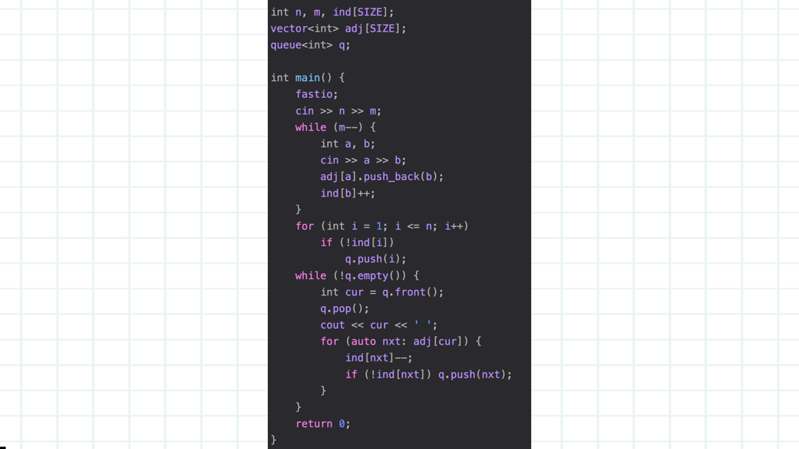

# 5주차

생성 일시: 2024년 9월 4일 오후 9:32

5주차는 위상정렬입니다. 트리 이후에 이진 검색 트리를 할까 고민을 많이 했는데 코테에서 나오기에는 높은 난이도라고 생각해서 뺏습니다 😗

위상정렬은 한번쯤은 들어봤죠. 위상정렬의 가장 쉬운 예시는 선수과목입니다. 위 피피티를 예시로 들면 프로그래밍 1 과목을 수강해야 프로그래밍 2와 자료구조 과목을 들을 수 있는 구조죠. 들을 수 있는 과목을 먼저 출력해주는 알고리즘 = 위상정렬입니다

위상정렬의 핵심은 진입차수(indegree) 입니다. 특정 노드에 대해서 다른 노드로부터 들어오는 간선의 개수를 말하는겁니다. 위 피피티를 보면 쉽게 이해할 수 있겠죠

로직을 알아보도록 하겠습니다. 기본적으로 위상정렬은 방향 그래프 입니다. 따라서 입력을 받으면서 진입차수(indegree) 를 기록할 수 있겠죠.

1. 입력 받으며 진입차수(indegree) 를 기록한다
2. 진입차수가 0인 정점을 큐에 삽입한다
3. 큐에서 원소를 꺼내고 이어져 있는 노드의 진입차수를 감소시킨다
4. 만약 이어져 있는 노드의 진입차수가 0이 된다면 큐에 삽입한다
5. 큐가 빌 때 까지 2번으로 돌아가며 반복한다

예시코드입니다. 로직과 정확히 동일하죠. 구현도 어렵지 않아서 따로 설명하진 않을게요

지난주차 트리 문제를 풀면서 사이클을 정말 많이 찾았죠. 위상정렬은 비교적 사이클을 쉽게 찾을 수 있습니다. 로직을 마쳤을 때 큐에 들어가지 않은 노드가 있다? → 사이클입니다. 쉽쥬

이번주차는 문제집이 크게 어렵지 않아서 많이 도전해보시기 바랍니다. 특히 코테를 준비하시는 분들은 1005번 ACM Craft 반드시 풀어보세요!