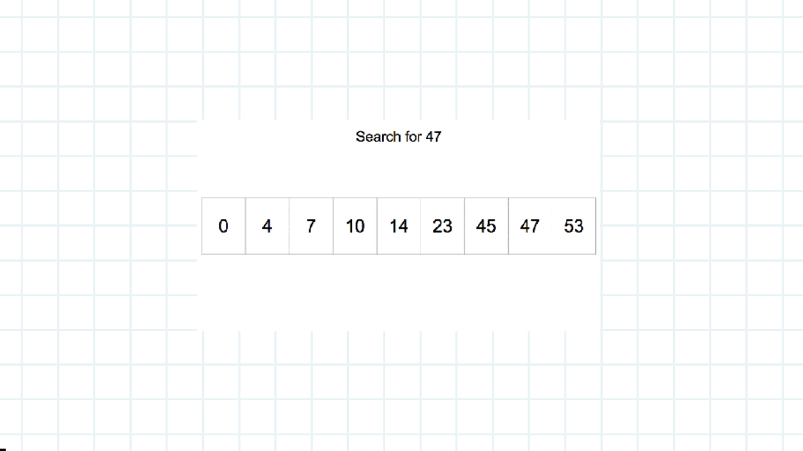
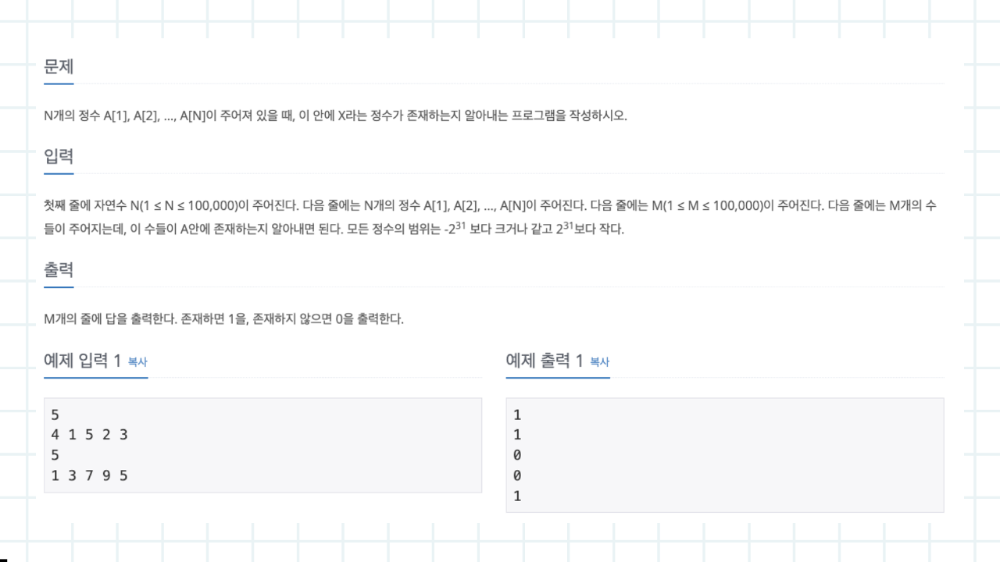
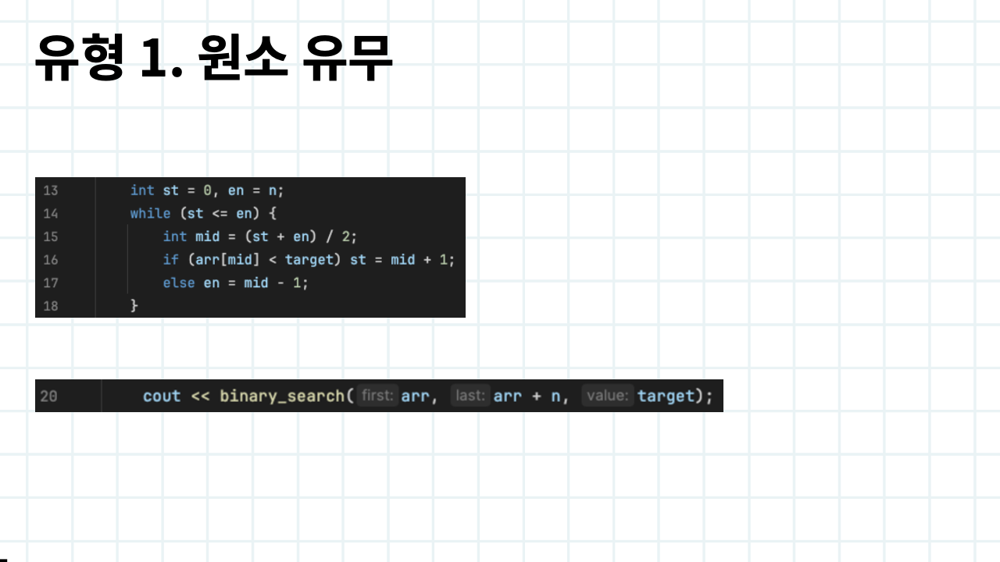
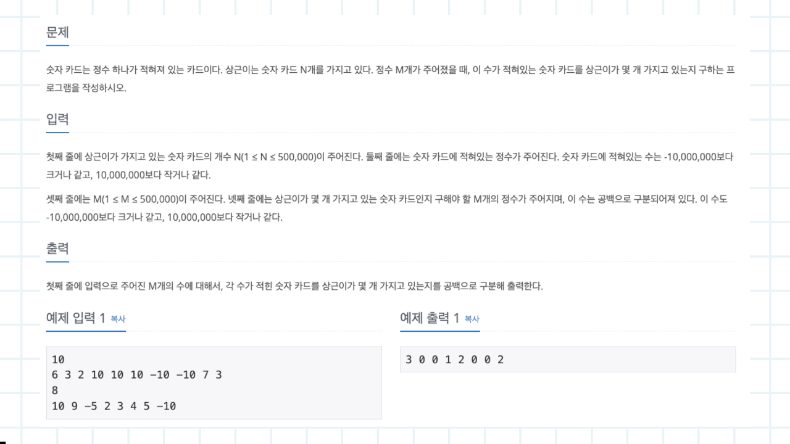
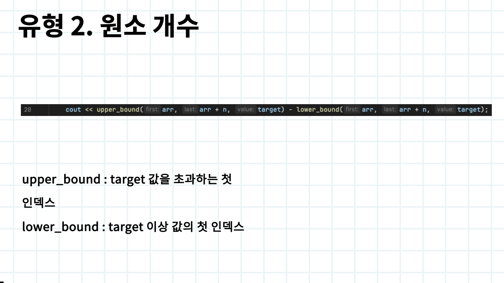
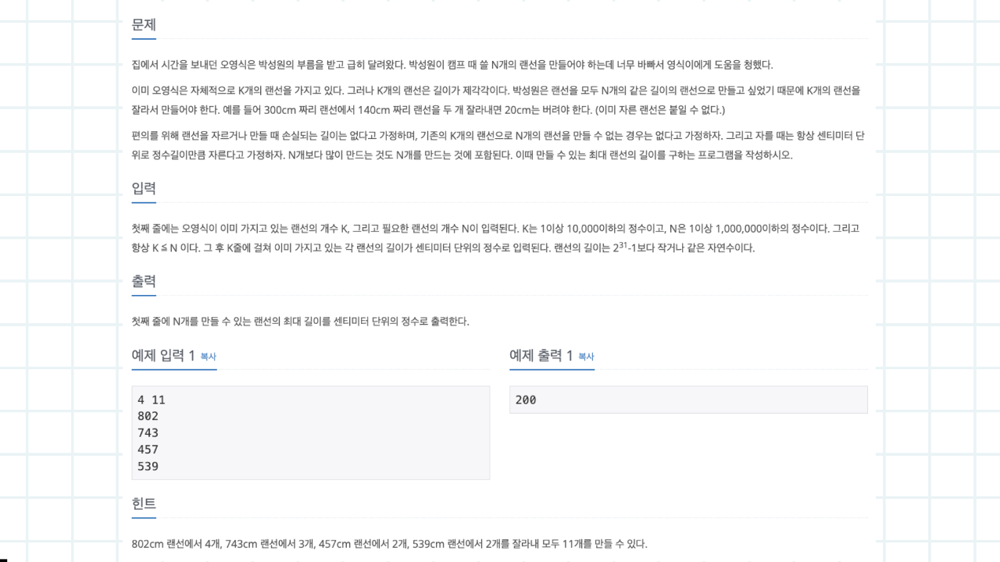
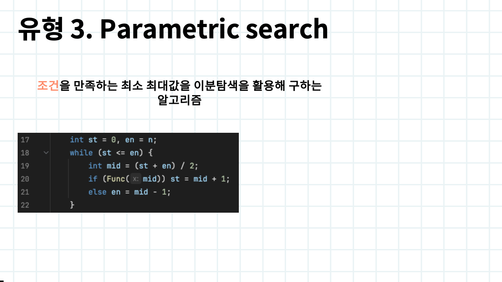

# 6주차

생성 일시: 2024년 9월 10일 오후 10:07

이번주차는 이분탐색입니다. 그래프를 하다가 웬 탐색이냐 싶겠지만 일부러 이렇게 배치했습니다. 다른 유형의 알고리즘을 계속 공부해줘야해요

이분탐색 GIF 인데 왜 안움직이지 어떻게 동작하는지 다들 아실테니 넘어가겠습니다

문제를 먼저 살펴보고 유형을 알아보도록 하겠습니다. 길이가 N(≤100,000) 인 배열에서 X 값을 찾는 문제입니다. 쿼리가 M(≤100,000) 개 들어오기 때문에 선형적으로 풀면 당연히 시간초과가 발생하겠죠

이런 유형을 원소 유무 확인 유형이라고 부릅니다. “이분탐색을 사용해서 해당 원소가 배열 내에 있는지 찾아라.” 죠. 첫번째 코드처럼 이분탐색을 구현해서 작성하셔도 되고, binary_search STL 을 사용해도 됩니다. 배열 내에 찾는 값이 있다면 1 없으면 0을 출력합니다. 가장 쉬운 유형이라 빠르게 넘어갈게요

두 번째 문제입니다. N(500,000)개의 배열을 입력받고 배열에서 X 가 몇개 있는지 쿼리를 M(500,000)개 처리하는 문제입니다. 이 문제도 선형적으로 풀면 당연히 시간초과가 발생하겠죠

1번 유형과는 다르게 “배열에서 찾는 원소가 몇개 있는가?” 를 묻고 있습니다. STL 을 사용해서 쉽게 해결할 수 있습니다. upper_bound 는 target 값을 초과하는 첫 인덱스를 반환해주고, lower_bound 는 target 이상 값의 첫 인덱스를 반환합니다. 차를 구하면 쉽게 정답을 구할 수 있겠죠. 위 두 STL 은 자주 사용되니 반드시 숙지하시기 바랍니다

세 번째 문제입니다. K 개의 랜선을 가지고 있고 랜선의 길이는 제각각이다. 랜선을 N 개 만들건데 N 개를 만들 수 있는 랜선의 최대 길이를 구하라는 문제입니다. 하지만 랜선의 길이가 21억이기 때문에 선형적으로 하나씩 검사하면 시간초과가 발생합니다

이런 유형을 Parametric search 라고 부릅니다. 조건을 만족하면서 최소 최대값을 이분탐색을 활용해 구하도록 유도하고 있죠. 기존의 이분탐색 코드에 Func 라는 함수를 만들어 문제의 조건에 맞도록 탐색을 진행하도록 구현하면 됩니다

이분탐색은 다들 배웠을테니 익숙하고 구현도 어렵지 않죠. 하지만 문제를 많이 풀어보셔야 합니다. 그래서 실습 위주로 진행했어요. 특히 3번째 유형 같은 경우에는 이분탐색이라고 눈치도 못채는 경우도 많습니다. 코테 단골 문제이기 때문에 반드시 숙지하시기 바랍니다. 개강이라 힘들텐데 다들 화이팅 👏